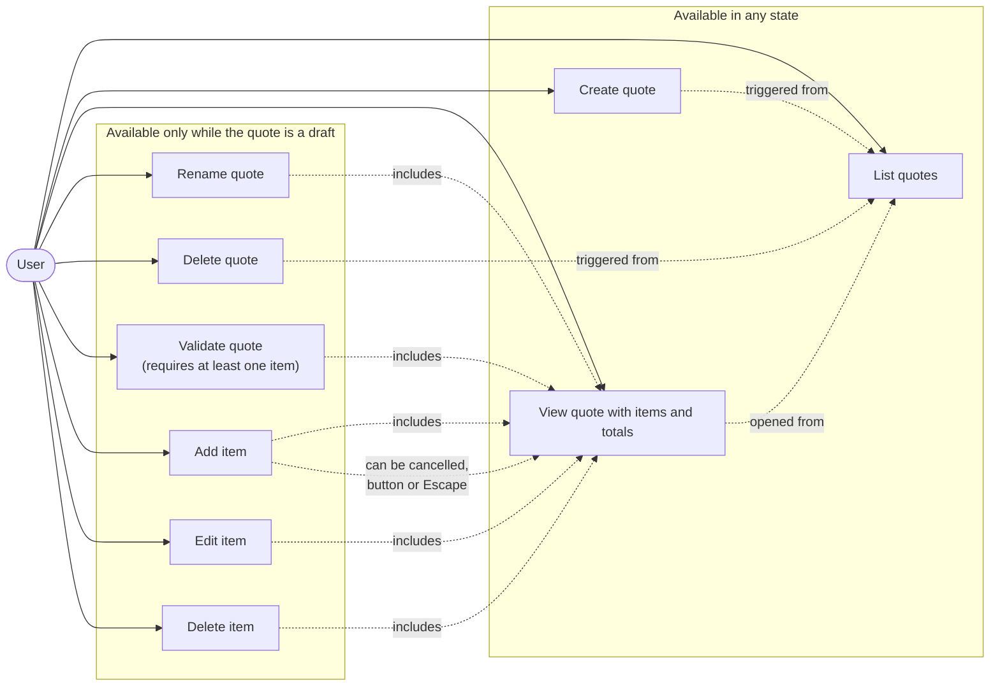
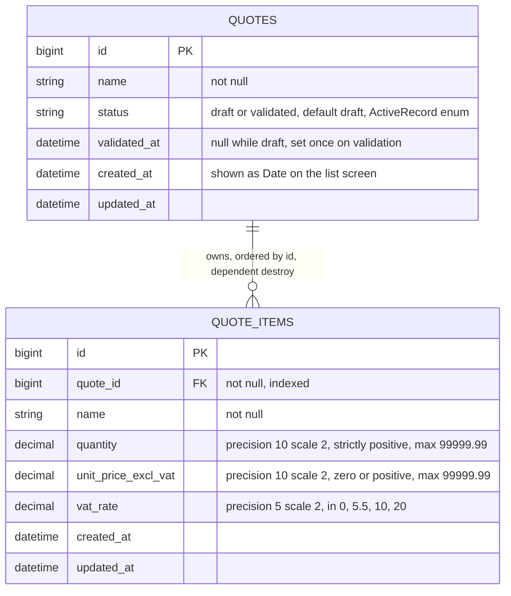
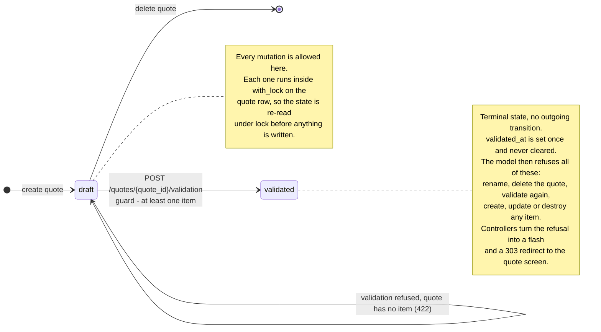
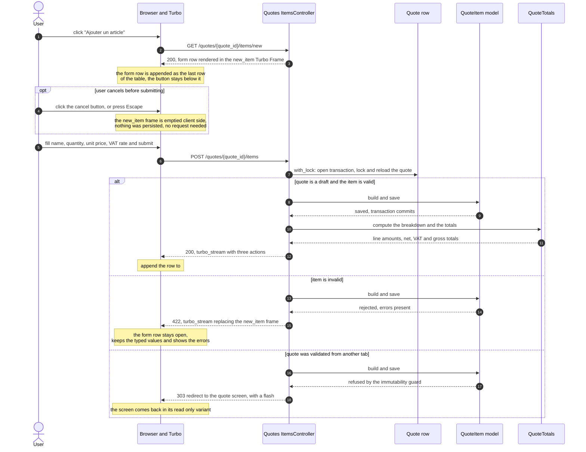

# Architecture

Four diagrams, each answering one question. The reasoning behind the money computation is not
repeated here: [logbook.md](logbook.md) is the single source of truth for it, and this file points
at it rather than restating it.

Two invariants hold across all of them:

1. A validated quote can no longer be modified or deleted, itself or its items.
2. A quote with no item cannot be validated.

Amounts are never persisted: they are derived from the items on every render, for a draft as for a
validated quote. That is a deliberate simplification, and the reasons for it, along with what it
would take to freeze them instead, are in the logbook under "Deliberately kept simple".

## 1. Use cases

Answers: what can the single actor do, and which actions are gated by the quote state? The grouping
is the important part: everything in the second group is refused once the quote is validated.

Authentication is out of scope (see logbook), so the actor is anonymous and unscoped: there is no
partner account, and every quote is visible to whoever opens the application. "User" below is a
role, not an authenticated identity.

Cancelling the add-item row is not a use case of its own: nothing is persisted, the row is simply
discarded client side. It appears here because the Figma showed no cancel affordance and the
decision to add one is a deliberate deviation (see logbook).

## 2. Data model

Answers: what is persisted?

Only the raw data is. Every amount shown on screen, per line and in the totals block, is computed by
`QuoteTotals` from the columns below.

Notes on the columns:

- `status` is a string column backed by an ActiveRecord enum, not a PostgreSQL enum type: adding a
  value later is a data migration rather than a type migration. It is never exposed through strong
  params; a quote changes status only through `Quotes::ValidationsController#create`.
- `vat_rate` is constrained by a model validation only. Why there is no database CHECK here is in
  the logbook, under "Deliberately kept simple".
- `quantity` and `unit_price_excl_vat` are validated against the scale of their column, on the raw
  input rather than on the cast attribute, because ActiveRecord rounds to the column scale at
  assignment time. See the logbook, "Money representation".
- Both are capped at 99 999.99, so that an out-of-range value is a form error and never a PostgreSQL
  exception surfacing as a 500.
- `quantity` is a decimal so that fractional units stay expressible, for instance half days of venue
  rental. Confirmed with the recruiter.
- Naming follows the EN 16931 vocabulary (net = before VAT, gross = after VAT). The French labels HT
  / TVA / TTC exist only in the locale files, never in an identifier.

Deleting a quote cascades to its items (`dependent: :destroy`), which only ever happens while the
quote is a draft.

## 3. Quote lifecycle

Answers: what does validation actually forbid?

Read this diagram by what is missing. The `validated` state has no outgoing arrow at all, including
no arrow to the final state, because a validated quote cannot even be deleted.

The check lives in the models, not in the controllers. `Quote` refuses its own mutations, and
`QuoteItem` refuses any write whose parent quote is validated, so the guard holds even for a write
that never goes through `Quotes::ItemsController`.

Both guards read the **persisted** status, never the in-memory one: the transition assigns
`status = :validated` before saving, so a guard reading the in-memory value would make validation
refuse itself.

Validation itself needs no diagram of its own. `Quotes::ValidationsController#create` calls
`finalize!` inside `with_lock`, which re-reads the quote under lock, refuses with a 422 if it has no
item, refuses with the immutability error if it is already validated, and otherwise writes `status`
and `validated_at` before redirecting to the read-only screen with a 303.

## 4. Adding an item

Answers: how does a single item creation update the page without a reload?

The detail screen is never reloaded. One POST returns one Turbo Stream response carrying several
actions, so the new row and the totals block stay consistent. The "Ajouter un article" button is a
permanent element below the table and never disappears.

Editing an item follows the same shape, with `PATCH /quotes/{quote_id}/items/{id}` and a `replace`
on the existing row instead of an `append`. Deleting follows it with a `remove` on the row.

One point to confirm against Turbo's real behaviour rather than assume, and to correct here once
tested: whether the success status should be 200 or 201 for a stream body. The immutability branch
deliberately avoids the question by redirecting, see the logbook under "Deliberately kept simple".

**Rounding, in three lines.** Each line's net amount is rounded to two decimals first; lines are
grouped by VAT rate and each group's VAT is computed once, on that group's summed net amount; the
resulting cents are then allocated back to the lines by largest remainder, ties broken by item `id`,
so the column sums exactly to the footer. The full algorithm, the EN 16931 rules it follows, the
reconciliation it adds on top of them and the trade-off it accepts are in
[logbook.md](logbook.md), section "The VAT computation contract". They are not duplicated here so
that there is only one version to keep correct.