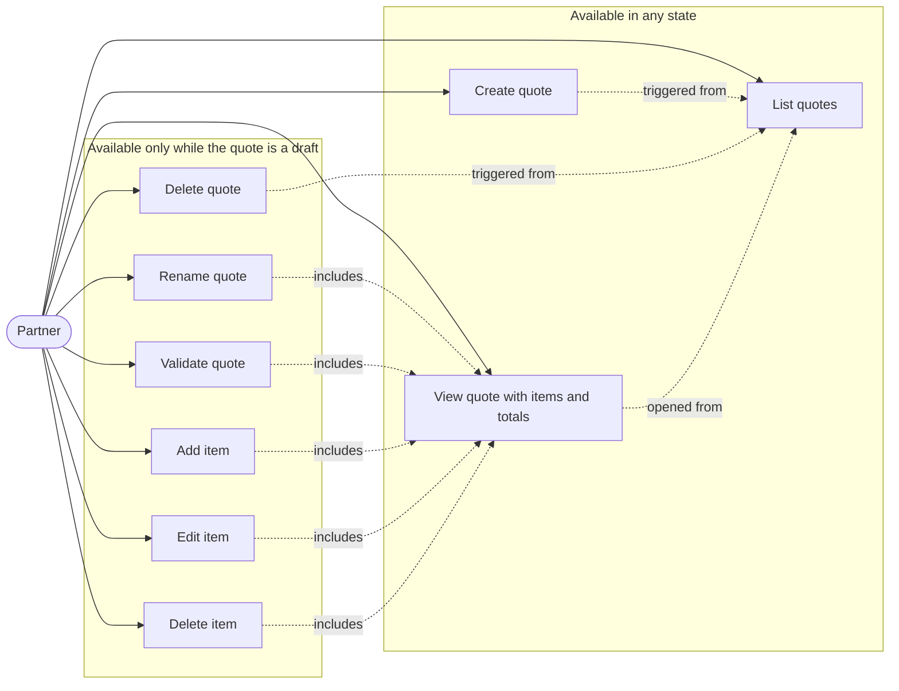
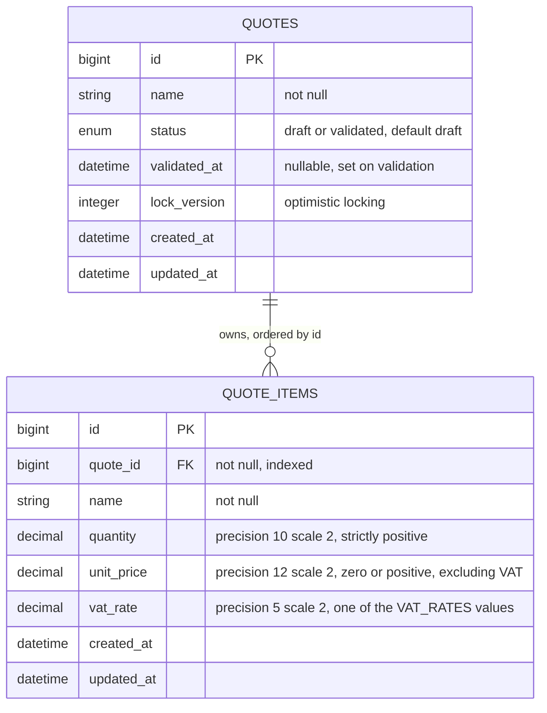
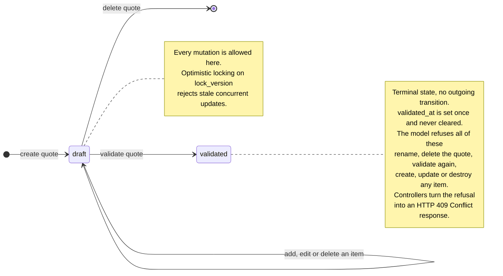
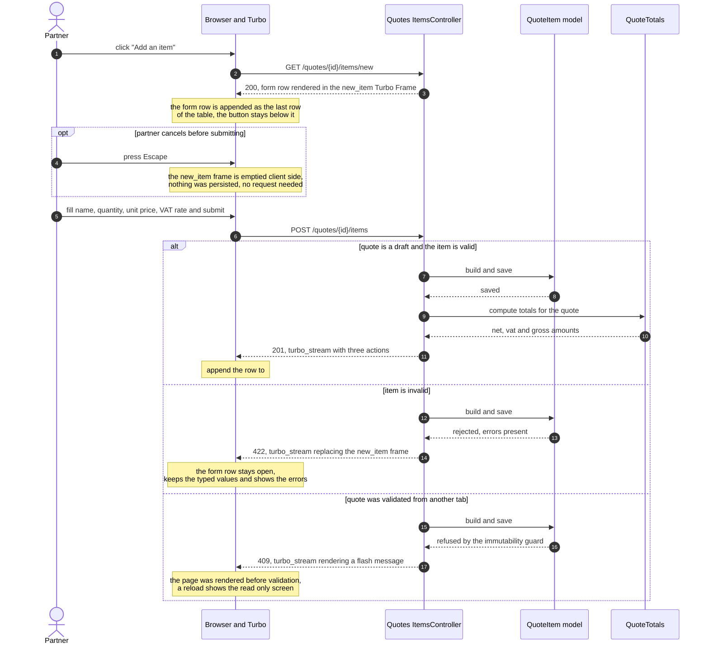

# Architecture

## 1. Use cases

Answers: what can the single actor do, and which actions are gated by the quote state?
The grouping is the important part. Everything in the second group is refused once the
quote is validated, which is the only invariant of this application.

## 2. Data model

Answers: what is persisted, and what is not?
Totals are absent on purpose. They are derived by the `QuoteTotals` object, never stored,
so there is no denormalised value to keep in sync.

Deleting a quote cascades to its items (`dependent: :destroy`), which only ever happens
while the quote is a draft.

Open question: `quantity` is a decimal so that fractional units stay expressible, for
instance half days of venue rental. If quantities are always whole units, an integer is
enough and the rounding contract gets simpler.

## 3. Quote lifecycle

Answers: what does validation actually forbid?
Read this diagram by what is missing. The `validated` state has no outgoing arrow at all,
including no arrow to the final state, because a validated quote cannot even be deleted.

The check lives in the models, not in the controllers. `Quote` refuses its own mutations,
and `QuoteItem` refuses any write whose parent quote is validated, so the guard holds even
for a write that never goes through `Quotes::ItemsController`.

## 4. Adding an item

Answers: how does a single item creation update the page without a reload?
The detail screen is never reloaded. One POST returns one Turbo Stream response carrying
several actions, so the new row and the totals block stay consistent. The "Add an item"
button is a permanent element below the table and never disappears.

Editing an item follows the same shape, with `PATCH /quotes/{quote_id}/items/{id}` and a
`replace` on the existing row instead of an `append`.

Rounding contract used by `QuoteTotals`: each line total is rounded to two decimals, lines
are grouped by VAT rate, VAT is computed once per rate group on the rounded subtotal, then
the group results are summed.